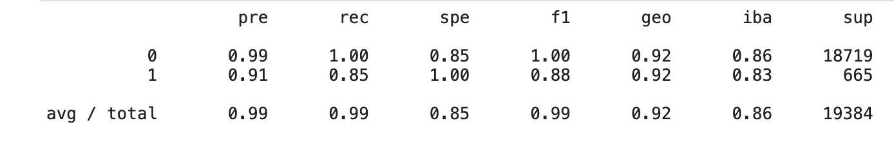
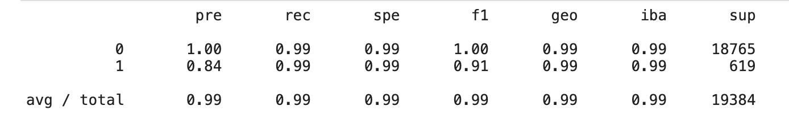

# Credit Risk Analysis Report

## Overview of the Analysis

Credit risk poses a classification problem that’s inherently imbalanced. This is because healthy loans easily outnumber risky loans. Knowing that information, I leveraged various techniques to train and evaluate models with imbalanced classes in order to accurately analyze credit risk. 

I leveraged a dataset of historical lending activity from a peer-to-peer lending services company, with the end goal being able to identify the creditworthiness of borrowers. 

In order to have a full analysis, I broke the steps down into the following:

- Split the Data into Training and Testing Sets
    
- Create a Logistic Regression Model with the Original Data

- Predict a Logistic Regression Model with Resampled Training Data

- Write a Credit Risk Analysis Report

The machine learning model and techniques used for the analysis are the following: 

* Logistic regression model - used to compare two versions of the dataset 
    - 1st version - original dataset 
    - 2nd version - resampled data using the RandomOverSampler module from the imbalanced-learn library
 
 
* For both versions, I did the following:
     - Counted the target classes
     - Trained a logistic regression classifier
     - Calculated the balanced accuracy score
     - Generated a confusion matrix
     - Generated a classification report
     

## Results

* Machine Learning Model - Original Dataset:

* Machine Learning Model - Resampled Dataset:

## Summary

* The logistic regression model fit with the oversampled data has a higher accuracy (99%) compared to the original data(95%). More importantly, it has a better specificity, which means less mistakes on false negatives and more accurate on the true negatives. From a business standpoint, this is extremely valuable, as you will lose more money on the riskier loans, so there's a higher need for accuracy there. Focus on the 1's!

---

## Technologies

This project leverages python 3.7 with the following packages:

* [imbalance-learn](https://imbalanced-learn.org/stable/) - A python package offering a number of re-sampling techniques

* [PyDotPlus](https://pydotplus.readthedocs.io/) - Provides a Python Interface to Graphviz's Dotlanguage

---

## Installation Guide

Install imbalance-learn by running the following command:
    
	conda install -c conda-forge imbalanced-learn
    
Install PyDotPlus by running the following command:
    
	conda install -c conda-forge pydotplus
    

---

## Contributors

Brought to you by Edgar Coronado

---

## License

MIT